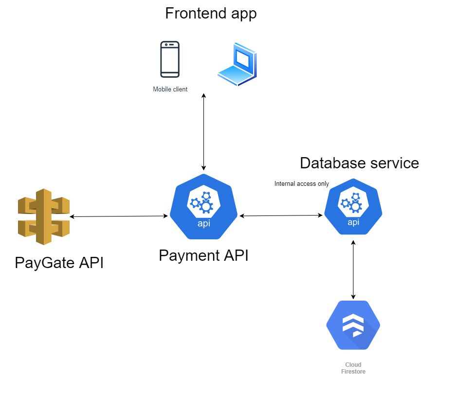
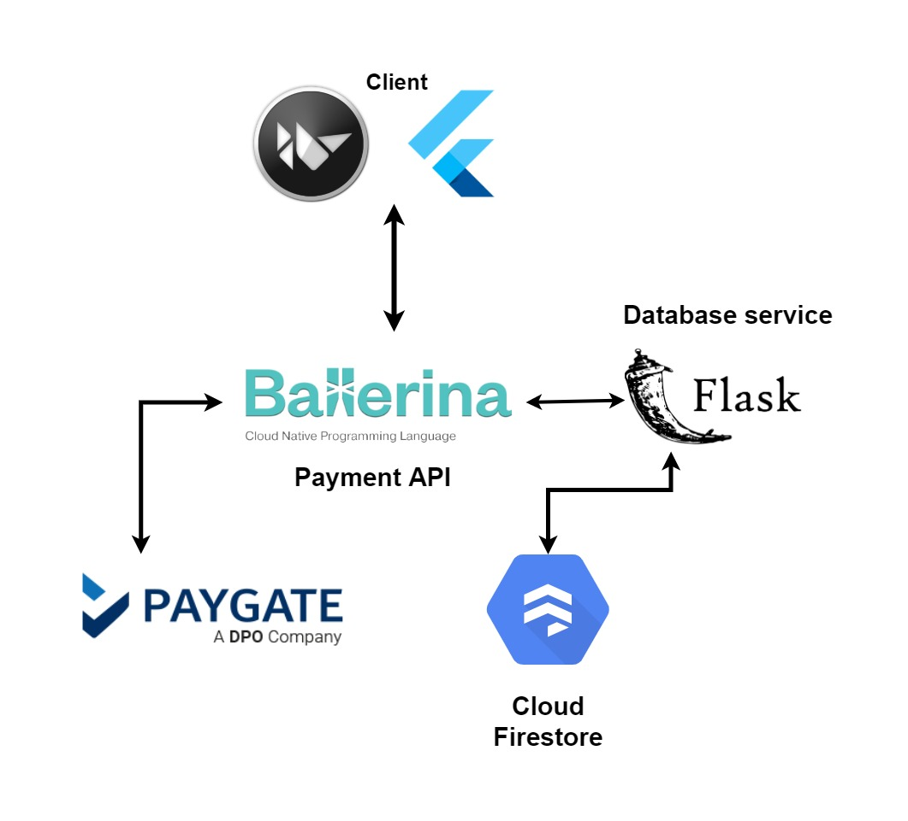

# Payment Gateway API
 An online payment solution utilizing PayGate

## Purpose
```
You may find that a popular payment provider such as Stripe is not supported in your country. Therefore you may need to implement your own solution which interacts with a viable payment provider's system.
```
### Project Structure
> database_service
* An abstract layer to a database
> gateway
* The payment API
> frontend
* Client application to consume payment API

### Links
* [Youtube video of project](https://youtu.be/1QhEi0UmpJg)
* [Ballerina](https://ballerina.io)
* [Kivy](https://kivy.org)
* [PayGate](https://docs.paygate.co.za/#payweb-3)


## High Level Architecture


## Low Level Architecture
